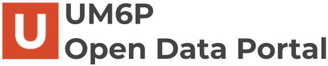

# UM6P Open Data Portal

<p align="center">
  
</p>

This repository contains the static website for the **UM6P Open Data Portal (UODP)**, a lightweight front page for UM6P’s open data initiative. It highlights flagship datasets, explains the vision behind the portal, and links users to the Dataverse instance and contribution channels.

## Features

- Static, fast-loading landing page (HTML/CSS/JS, no backend required)
- Sections for **Home**, **About**, **Dataverse**, **Submit Request**, and **Join Us**
- Highlight cards for sample datasets (e.g., Arabic social media sentiment, Moroccan vehicle plates OCR)
- Outbound links to the UM6P Dataverse and institutional resources
- Ready for deployment on GitHub Pages with a custom domain via `CNAME` (`uodp.org`)

## Getting Started

1. Clone or download this repository.
2. Open `index.html` directly in a browser **or** serve it locally with any static server, e.g.:

```
   bash
   python -m http.server 8000
````

No build step is required; everything is plain HTML, CSS, and JavaScript.

## Customization

* Edit **`index.html`** to change text, sections, or dataset cards.
* Update assets (logos, banners, icons) in **`assets/images/`**.
* Adjust styling in **`assets/main.css`** and behavior in **`assets/main.js`**.
* If you fork this project, update or remove **`CNAME`** to match your own domain.

## License

This project is licensed under the **MIT License**.
See [`LICENSE`](LICENSE) for details.
